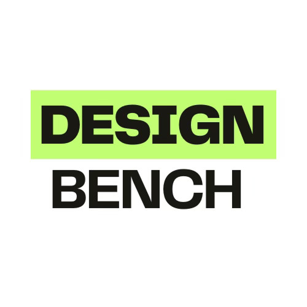

<p align="center">
  
</p>

# DesignBench

DesignBench is a Go CLI that runs cross-platform UI render benchmarks for Kotlin Multiplatform apps. It orchestrates Android Compose and iOS SwiftUI targets, records render/system metrics, and emits JSON reports for CI.

## Install

**Homebrew (macOS/Linux):**

```sh
brew tap tahatesser/designbench https://github.com/tahatesser/designbench.git
brew install designbench          # installs the latest tagged release
# or install straight from `main`
brew install designbench --HEAD
```

## Core Commands

| Command | Purpose | Key flags |
| --- | --- | --- |
| `designbench preflight` | PASS/WARN/FAIL checklist for tooling (adb/xcodebuild/xcrun), project manifests, and attached devices. | *(none – everything auto-detected)* |
| `designbench android` | Runs Compose benchmark via `adb shell am start -W`, captures launch + CPU/memory metrics, saves JSON. | `--view`, `--component` |
| `designbench ios` | Runs SwiftUI benchmark using `xcrun simctl launch`, captures render + CPU/memory metrics, saves JSON. | `--view`, `--component` |

`--view` labels the UI under test, while `--component` controls the report filename token. Package/activity and bundle identifiers are inferred from `AndroidManifest.xml` and `Info.plist` when you run commands from the project root.

## Typical Flow

1. `designbench preflight` – confirm tools, manifests, and devices are ready.
2. Build and install the KMP app on Android (via Gradle) and iOS (via Xcode).
3. `designbench android --view ScreenX --component ScreenX`
4. `designbench ios --view ScreenX --component ScreenX`

Both platform commands write JSON to `designbench-reports/` (override with `--output`) and print a terminal summary that includes launch timings, CPU%, CPU time, memory usage, and device metadata.

## Reports

Each report stores:
- component label and CLI invocation
- render metrics (`FirstFrameMs`, `TotalTimeMs`, `RenderTimeMs`)
- system metrics (memory MB, CPU %, CPU time)
- timestamp and device details (model/OS/resolution or simulator name/runtime)

The data is CI-friendly and can be diffed against baselines for regressions.

## Example Report

```json
{
  "component": "ScreenX",
  "cliCommand": "designbench android --view ScreenX --component ScreenX --output reports/screenx-android.json",
  "android": {
    "component": "ScreenX",
    "package": "com.example.app",
    "activity": ".BenchmarkActivity",
    "firstFrameMs": 8.1,
    "totalTimeMs": 12.4,
    "waitTimeMs": 14.0,
    "memoryMB": 42.0,
    "cpuPercent": 9.8,
    "cpuTimeMs": 1500,
    "device": {
      "id": "FA6AX0301234",
      "platform": "android",
      "model": "Pixel 7",
      "osVersion": "14",
      "resolution": "1080x2400"
    },
    "timestamp": "2024-05-01T12:34:56Z"
  }
}
```

## CI Support

`.github/workflows/android-ci.yml` defines a GitHub Actions job that:
1. Runs `go test ./...`.
2. Builds the CLI.
3. Uses `scripts/mock-adb.sh` to run a smoke `designbench android` invocation without physical hardware, writing JSON via `--output` for CI artifacts.

Use it as a template—swap the mock bridge for a real device lab when available.
